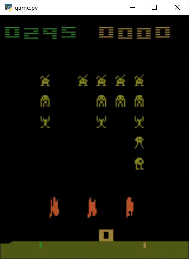
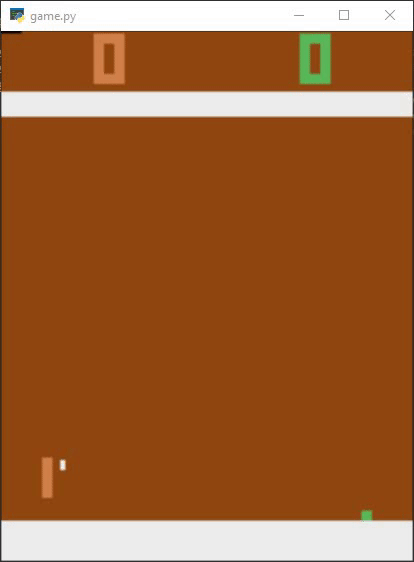

# Atari-AI
Teach AI to Play Arcade Games in the Atari Gym

## Actor Critic Neural Network
It is a method that uses two neural networks to optimize performance. The Actor Network is the AI agent that plays the game while the Critic Network classifies the game as a good or a bad one. 

